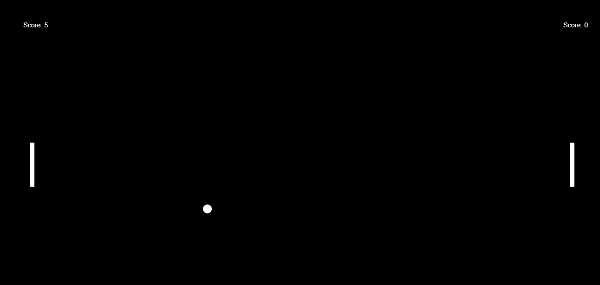

# Rust Pong Game with WebAssembly

This is a simple implementation of the classic Pong game written in Rust and compiled to WebAssembly (WASM). The game can be played directly in the browser and demonstrates how to integrate Rust code with JavaScript using WebAssembly.Getting Started

To play the game, simply open the ```index.html``` file in your browser. This file loads the game code and starts the game loop.

## Building the Game

To build the game from source, you will need to have Rust and the WebAssembly target installed on your system. Once you have Rust installed, you can install the WebAssembly target by running
```sql
$ rustup target add wasm32-unknown-unknown
```

Next, navigate to the root directory of the project and run the following command to build the game
```css
$ wasm-pack build --target web
```

This will compile the Rust code to WebAssembly and generate the JavaScript wrapper code needed to run the game in the browser. The output files will be placed in the ```pkg/``` directory.

## Running the Game Locally

To run the game locally, you will need to serve the ```index.html``` file from a web server. One easy way to do this is to use the ```http-server``` package from npm. If you don't have npm installed, you can download it from https://www.npmjs.com/get-npm.

Once you have npm installed, you can install the ```http-server``` package by running
```ruby
$ npm install -g http-server
```

Next, navigate to the root directory of the project and run the following command to start the web server
```ruby
$ http-server .
```

This will start the server and print the URL to access the game in your browser. Navigate to this URL to play the game

### Game

